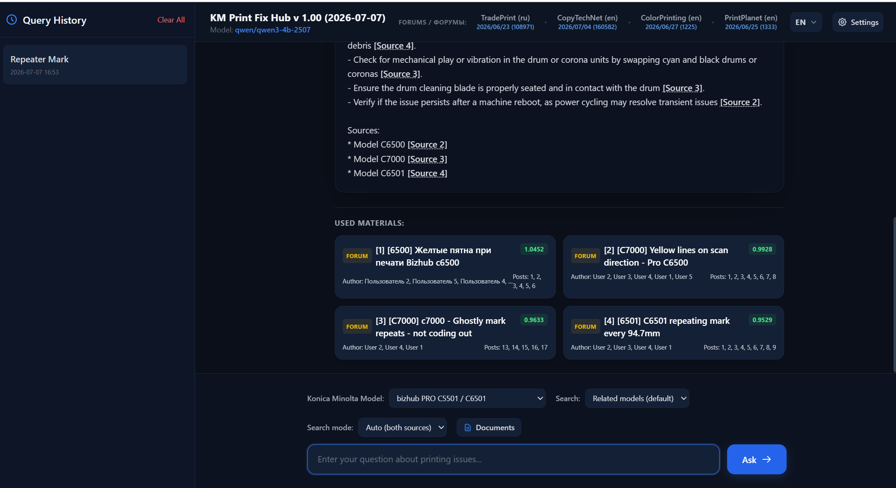
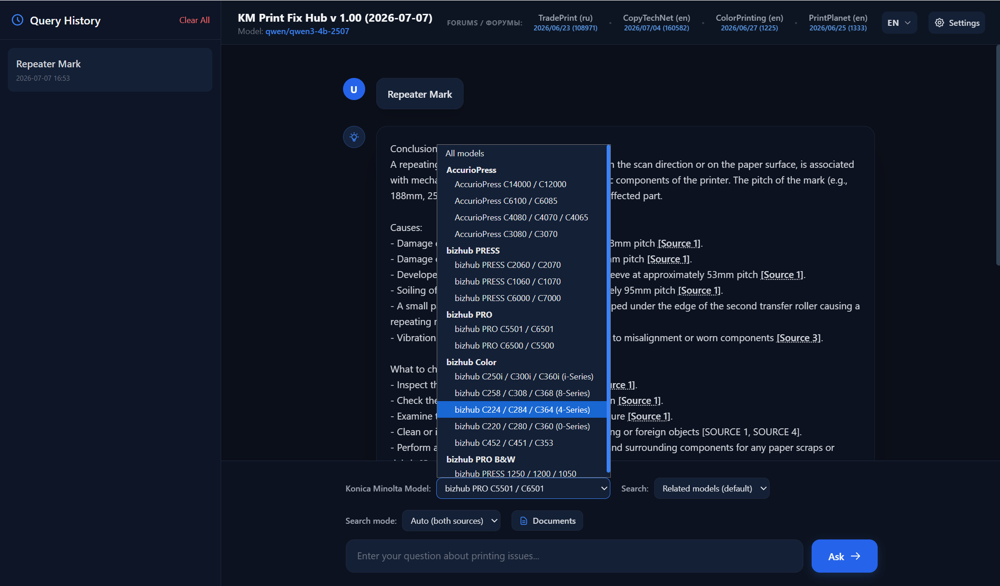
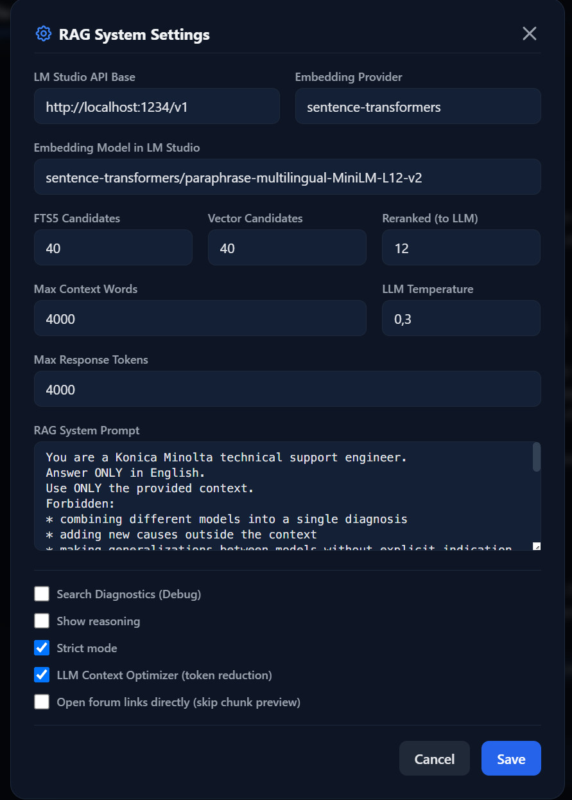

# KM Print Fix Hub

Bilingual documentation / Двуязычная документация: **[English](#english) | [Русский](#русский)**

<p align="center">
  
  
  
</p>

---

## English

RAG (Retrieval-Augmented Generation) search engine and interactive technical support system for Konica Minolta production printers and copiers.

### 🌟 Features
* **Semantic & Keyword Search**: Combined BM25 (SQLite FTS5) and dense vector search (FAISS) for precise troubleshooting matching.
* **LLM Context Optimizer**: Custom pipeline to merge overlapping threads, strip duplicated quote blocks, and filter out conversational noise, saving up to 70% of LLM token context size.
* **Official Manuals & Forums**: Serves official PDF service manuals (directing to the exact page) and technical forum archives (TradePrint, CopyTechNet, PrintPlanet, ColorPrinting).
* **Machine Logbook**: A localized maintenance logbook module enabling operators to record faults, solution details, replaced parts & counters, perform dynamic cross-linking between entries, and manage zip backups.
* **Multi-Language Support**: Complete interface translation in 10 languages and bilingual query translation (queries in any language are matched against English and Russian databases).
* **Anonymization Engine**: Light version replaces posters' names with generic identifiers to maintain privacy.

---

### 💻 Installation & Setup

#### 1. Setup LLM Provider (LM Studio or Ollama)

**Option A: LM Studio**
1. Install [LM Studio](https://lmstudio.ai/).
2. Search and download the recommended model: `qwen/qwen3-4b-2507`.
3. In the "Local Server" tab, select the model and click **Start Server**.
4. > [!IMPORTANT]
   > Ensure that the **Context Length** in LM Studio is set to **16,000** or higher to accommodate RAG search matches.

**Option B: Ollama**
1. Install [Ollama](https://ollama.com/).
2. Pull the recommended model using your terminal:
   ```bash
   ollama pull qwen2.5:4b
   ```
3. Open the application, open the **Settings** modal, select **Ollama** as your LLM Provider, and set the LLM Model Name to `qwen2.5:4b`. You can also configure Ollama as your Embedding Provider (with model `nomic-embed-text`).

#### 2. Install Python & Dependencies
1. Install Python 3.10 or newer.
2. Clone the repository code and install requirements:
   ```bash
   pip install -r requirements.txt
   ```

#### 3. Database Download (Mega.nz)
Since database indices are large, they are hosted externally.
1. Download the required database ZIP:
   * **[Mega.nz Link for Light/Anonymized Index (Index_anon.zip)](https://mega.nz/file/Oh52lJaT#e8kGp7mMv-71iP6GZdN3N7XS0bUVuFT_miDUbYBDMWw)**
2. Extract the index contents into the `Index/` folder in the project root.

#### 4. Launching the App
Run the startup script:
```bash
start.bat
```
Open your browser and navigate to: `http://127.0.0.1:8000/`

#### 5. Indexing Your Own PDF Manuals
To index your own Konica Minolta PDF service manuals:
1. Place your PDF files into the `Service_manuals/` directory in the project root.
   * **Tip**: If a manual covers multiple models, list their names in the PDF filename (separated by underscores, e.g. `AccurioPress_C14010_C12010_C10500_SM.pdf`). The system will automatically map all pages of this manual to each of those models.
2. Run the `PDF_INDEXING_ONLY.bat` script. This will extract and index the text of the PDF files, automatically moving them from `Service_manuals/` to the `Archive/official/` folder (to avoid taking duplicate space).
3. If you need to remove PDF files from the index: manually delete them from the `Archive/official/` directory and run the `PDF_INDEXING_ONLY.bat` script. The index will rebuild and remove their data from the database.

#### 6. Customizing Supported Models List
If a specific Konica Minolta model is missing from the dropdown or is not recognized during searches, you can add it manually:
1. Open the `models_list.txt` file located in the project root folder.
2. Add your model name (one per line, e.g., `C14020`) and save the file.
3. Run `PDF_INDEXING_ONLY.bat` to re-index your manuals so they map correctly to the newly added model.

---

## Русский

Поисковая RAG-система и интерактивный помощник технической поддержки по производительным печатным машинам и копирам Konica Minolta.

### 🌟 Возможности системы
* **Гибридный поиск**: Сочетание полнотекстового поиска FTS5 и векторной семантики (FAISS) для точного нахождения решений.
* **LLM Context Optimizer**: Интеллектуальный оптимизатор контекста, сжимающий его на 40-70% благодаря удалению цитат, склейке сообщений из одной ветки и фильтрации разговоров.
* **База знаний и PDF**: Индексация сервис-мануалов (с переходом на нужную страницу) и постов из 4 крупнейших форумов (TradePrint, CopyTechNet, PrintPlanet, ColorPrinting).
* **Machine Logbook (Бортовой журнал обслуживания)**: Локальный модуль фиксации ремонтов, позволяющий вести учет неисправностей, замененных деталей и счетчиков, связывать записи между собой и создавать резервные копии журналов.
* **Многоязычность**: Локализация интерфейса на 10 языков и автоматический перевод поисковых запросов.
* **Анонимизация данных**: Light-версия заменяет реальные имена пользователей на порядковые маркеры для конфиденциальности.

---

### 💻 Установка и запуск

#### 1. Настройка провайдера LLM (LM Studio или Ollama)

**Вариант А: LM Studio**
1. Установите [LM Studio](https://lmstudio.ai/).
2. Скачайте и выберите рекомендованную модель: `qwen/qwen3-4b-2507`.
3. Перейдите во вкладку "Local Server" и нажмите **Start Server**.
4. > [!IMPORTANT]
   > Обязательно выставите параметр **Context Length** (Размер контекста) в LM Studio на значение **16 000** или более.

**Вариант Б: Ollama**
1. Установите [Ollama](https://ollama.com/).
2. Скачайте рекомендованную модель через терминал:
   ```bash
   ollama pull qwen2.5:4b
   ```
3. Откройте приложение, перейдите в **Настройки**, выберите **Ollama** в качестве провайдера LLM и укажите название модели `qwen2.5:4b`. Также вы можете использовать Ollama в качестве провайдера эмбеддингов (с моделью `nomic-embed-text`).

#### 2. Установка Python и зависимостей
1. Установите Python 3.10 или новее.
2. Клонируйте код проекта и установите зависимости:
   ```bash
   pip install -r requirements.txt
   ```

#### 3. Загрузка базы данных (Mega.nz)
Файлы индексов базы знаний имеют большой объем и скачиваются отдельно.
1. Скачайте необходимый архив базы данных:
   * **[Ссылка на Mega.nz для Light (обезличенный индекс) (Index_anon.zip)](https://mega.nz/file/Oh52lJaT#e8kGp7mMv-71iP6GZdN3N7XS0bUVuFT_miDUbYBDMWw)**
2. Распакуйте содержимое архива индексов в папку `Index/` в корне проекта.

#### 4. Запуск приложения
Запустите стартовый файл:
```bash
start.bat
```
Откройте в браузере: `http://127.0.0.1:8000/`

#### 5. Индексирование собственных PDF-руководств
Для индексирования собственных сервис-мануалов Konica Minolta в формате PDF:
1. Поместите ваши файлы PDF в папку `Service_manuals/` в корне проекта.
   * **Совет**: Если руководство охватывает несколько моделей, перечислите их названия в имени файла PDF через подчеркивание (например, `AccurioPress_C14010_C12010_C10500_SM.pdf`). Система автоматически привяжет все страницы этого руководства к каждой из указанных моделей.
2. Запустите файл `PDF_INDEXING_ONLY.bat`. Скрипт извлечет текст, сгенерирует эмбеддинги и автоматически переместит PDF-файлы из папки `Service_manuals/` в папку `Archive\official/` (чтобы не занимать лишнее место на диске дублями файлов).
3. Если нужно удалить файлы PDF из индекса: вручную удалите их из папки `Archive\official/` и запустите файл `PDF_INDEXING_ONLY.bat`. Индекс перестроится и удалит информацию из базы данных.

#### 6. Добавление собственных моделей
Если какая-то модель Konica Minolta отсутствует в выпадающем списке или не распознается при поиске, вы можете добавить её самостоятельно:
1. Откройте файл `models_list.txt` в корневой папке проекта.
2. Допишите название вашей модели (по одной на строке, например, `C14020`) и сохраните изменения.
3. Запустите `PDF_INDEXING_ONLY.bat`, чтобы переиндексировать ваши мануалы с учетом новой модели.

---

### ☕ Support the Project / Поддержка проекта
If you find this project useful, you can support its development:  
Если проект оказался вам полезен, вы можете поддержать его разработку:
* **USDT (TRC20)**: `TBWzmMZWbirvACAtPfoZioAhhwSM4n2ArY`

---

### 🛠️ Other Projects / Мои проекты
* **[ComfyUI Photoshop Plugin (PH-CU-S)](https://github.com/SaidAuita/ComfyUI_PH-CU-S)**:
  A powerful Photoshop plugin powered by ComfyUI, providing direct integration with local generative models without any clouds, subscriptions, or recurring fees.  
  Мощный плагин для Photoshop на базе ComfyUI, обеспечивающий прямую интеграцию с локальными генеративными моделями без облаков, подписок и регулярных платежей.
